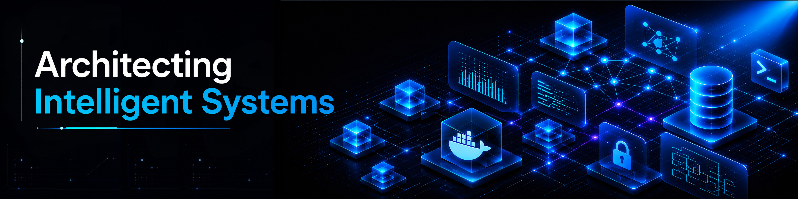

<div align="center">

<!-- High-Resolution Professional Systems Architecture Banner -->


<br/><br/>

<!-- Vibrant Glowing Electric Cyan & Cobalt Header Banner -->
<picture>
  <source media="(prefers-color-scheme: dark)" srcset="https://capsule-render.vercel.app/api?type=waving&color=0:003366,50:0077b5,100:00d2ff&height=160&section=header&text=Muhammad+Ali&stroke=00D2FF&strokeWidth=2&fontSize=38&fontColor=FFFFFF&fontAlignY=42&desc=Full-Stack+Software+Engineer+%7C+Systems+Architect&descAlignY=62&descSize=14" />
  <source media="(prefers-color-scheme: light)" srcset="https://capsule-render.vercel.app/api?type=waving&color=0:0052D4,50:4364F7,100:6FB1FC&height=160&section=header&text=Muhammad+Ali&stroke=0052D4&strokeWidth=2&fontSize=38&fontColor=FFFFFF&fontAlignY=42&desc=Full-Stack+Software+Engineer+%7C+Systems+Architect&descAlignY=62&descSize=14" />
  
</picture>

<br/>

<!-- Crisp Static Professional Headline -->
<h1>Muhammad Ali</h1>
<h3>Full-Stack Software Engineer & Systems Architect</h3>
<p><i>Architecting Scalable Microservices, Constraint Solvers & Stateful Agentic AI Systems</i></p>

<br/>

<!-- Executive Personal Channels & Contact Badges -->
<p align="center">
  <a href="https://m-ali-swe.tech" target="_blank" rel="noopener noreferrer">
    
  </a>&nbsp;
  <a href="https://linkedin.com/in/m-ali-swe" target="_blank" rel="noopener noreferrer">
    
  </a>&nbsp;
  <a href="https://github.com/m-ali-swe" target="_blank" rel="noopener noreferrer">
    
  </a>&nbsp;
  <a href="mailto:muhammadali5.swe@gmail.com">
    
  </a>&nbsp;
  
</p>

</div>

<br/>

---

<!-- ============================================================ -->
<!-- EXECUTIVE ARCHITECTURAL SUMMARY -->
<!-- ============================================================ -->

## 🏛️ Executive Systems Summary

```yaml
engineer: "Muhammad Ali"
title: "Full-Stack Software Engineer & Systems Architect"
education: "B.S. in Computer Science | Lahore Garrison University (LGU), Lahore, Pakistan"
contact: "+92-328-4983021 | muhammadali5.swe@gmail.com"
architectural_focus:
  - "Distributed Microservices & Modular Monolith Architecture"
  - "Constraint-Based Combinatorial Optimization (Google OR-Tools CP-SAT)"
  - "Stateful Multi-Agent AI Orchestration (LangGraph / Model Context Protocol)"
  - "High-Concurrency Real-Time Infrastructure (SSE / WebSockets / PostgreSQL)"
```

I am a **Full-Stack Software Engineer** specializing in architecting complex, production-grade software systems. My engineering focus centers on **solving high-concurrency algorithmic and architectural challenges**—from constraint-based automated schedule solvers and zero-trust transaction execution engines to stateful multi-agent LLM orchestration.

---

<!-- ============================================================ -->
<!-- TECHNICAL ARCHITECTURE MATRIX -->
<!-- ============================================================ -->

## 🛠️ Core Technical Architecture Matrix

<table>
<tr>
<td width="50%" valign="top">

### 🌐 Distributed Systems & Backend Engineering
- **Languages**: TypeScript, JavaScript, Python (3.11+), PHP, C++
- **Frontend Architecture**: Next.js 16/15 (App Router), React 19, Tailwind CSS v4, Zustand, TanStack Query, Shadcn/UI
- **Backend & APIs**: FastAPI, Node.js, Express.js, Async SQLAlchemy 2.0, Pydantic, RESTful APIs, WebSockets, Server-Sent Events (SSE)
- **Data Persistence**: PostgreSQL, MySQL, MongoDB, SQLite, Relational Data Modeling, Migrations (Alembic)

</td>
<td width="50%" valign="top">

### 🤖 Agentic AI & Operations Research
- **AI Orchestration**: LangGraph, LangChain, Multi-Agent Systems, Model Context Protocol (MCP)
- **LLM Integrations**: OpenAI SDK, Google Gemini SDK, Real-Time SSE Token Streaming
- **Operations Research**: Google OR-Tools (`ortools` CP-SAT Solver), Recursive Backtracking
- **Computer Vision**: OpenCV, YOLOv8, Image Processing Pipelines
- **DevOps & Infrastructure**: Docker, Docker Compose, Git/GitHub Actions, Linux (Ubuntu), VPS Deployment

</td>
</tr>
</table>

<br/>

<div align="center">
  
</div>

<br/>

---

<!-- ============================================================ -->
<!-- ENTERPRISE SYSTEM PORTFOLIO -->
<!-- ============================================================ -->

## 📂 Enterprise System Architecture Portfolio

<table>
<tr>
<th align="left" width="35%">System & Live Link</th>
<th align="left" width="45%">Architectural Breakthroughs</th>
<th align="left" width="20%">Tech Stack</th>
</tr>

<tr>
<td>
🎓 <b><a href="https://campus.m-ali-swe.tech">Campus URP v2.0</a></b><br/>
<i>Enterprise University Resource Planning</i><br/><br/>
<a href="https://campus.m-ali-swe.tech">🔗 Live Platform</a>
</td>
<td>
Architected an enterprise campus super-app integrating 7 master subsystems:
<ul>
  <li><b>IAM & JWT Security</b>: Dual-identity auth with rotatable PostgreSQL refresh tokens and instant session revocation.</li>
  <li><b>Timetable Auto-Scheduler</b>: Utilized Google OR-Tools CP-SAT solver to resolve multi-variable faculty, room, and cohort constraints across thousands of sections.</li>
  <li><b>Cafe POS KDS Engine</b>: Zero-trust financial engine with bounded wallet deductions, idempotency, and real-time Kitchen Display Sync.</li>
  <li><b>OPAC Library & Lost & Found</b>: Finite state machine governing item verification and book circulation workflows.</li>
</ul>
</td>
<td>
<code>Next.js 16</code><br/>
<code>FastAPI</code><br/>
<code>PostgreSQL</code><br/>
<code>Google OR-Tools</code><br/>
<code>LangGraph</code><br/>
<code>Docker</code>
</td>
</tr>

<tr>
<td>
🏥 <b><a href="https://phc-gaza.vercel.app">PHC Gaza Command Center</a></b><br/>
<i>Macro-Level Crisis Operations Platform</i><br/><br/>
<a href="https://phc-gaza.vercel.app">🔗 Live Application</a>
</td>
<td>
Macro-level executive crisis management web platform for healthcare infrastructure damage assessment, humanitarian supply logistics tracking, and operational intervention planning.
<ul>
  <li>Real-time GIS routing models and primary healthcare damage metrics.</li>
  <li>Cell-based analytics matrix for supply allocation and economic impact.</li>
</ul>
</td>
<td>
<code>Next.js 16</code><br/>
<code>React 19</code><br/>
<code>TypeScript</code><br/>
<code>Tailwind CSS v4</code><br/>
<code>Recharts</code><br/>
<code>Framer Motion</code>
</td>
</tr>

<tr>
<td>
🤖 <b><a href="https://github.com/m-ali-swe/multimodal-ai-assistant">Multimodal AI Assistant</a></b><br/>
<i>Stateful Agentic Conversational Engine</i><br/><br/>
<a href="https://github.com/m-ali-swe/multimodal-ai-assistant">🔗 Source Code</a>
</td>
<td>
Engineered a multimodal conversational interface managing dialog state persistence in PostgreSQL.
<ul>
  <li>Server-Sent Events (SSE) integration for real-time LLM token streaming.</li>
  <li>Stateful chat history retrieval ensuring low latency across multi-turn sessions.</li>
</ul>
</td>
<td>
<code>Next.js</code><br/>
<code>FastAPI</code><br/>
<code>OpenAI / Gemini SDKs</code><br/>
<code>PostgreSQL</code><br/>
<code>SSE Streaming</code>
</td>
</tr>

<tr>
<td>
👁️ <b><a href="https://github.com/m-ali-swe/visiontrack-cv">VisionTrack CV</a></b><br/>
<i>AI Attendance & Analytics Pipeline</i><br/><br/>
<a href="https://github.com/m-ali-swe/visiontrack-cv">🔗 Source Code</a>
</td>
<td>
Optimized computer vision pipeline for automated multi-face batch attendance scoring with real-time analytics.
<ul>
  <li>High-throughput OpenCV frame extraction coupled with YOLOv8 face detection.</li>
  <li>Confidence scoring engine with SQLite audit logging.</li>
</ul>
</td>
<td>
<code>Python 3.11</code><br/>
<code>OpenCV</code><br/>
<code>YOLOv8</code><br/>
<code>SQLite</code>
</td>
</tr>

<tr>
<td>
🏢 <b><a href="https://support.lgu.edu.pk">LGU Support Portal</a></b><br/>
<i>Official Campus Ticketing Infrastructure</i><br/><br/>
<a href="https://support.lgu.edu.pk">🔗 Production Portal</a>
</td>
<td>
Architected and deployed the official LGU Support Portal (`support.lgu.edu.pk`) from scratch, digitizing campus facility and IT ticketing across university departments.
</td>
<td>
<code>Next.js</code><br/>
<code>FastAPI</code><br/>
<code>PostgreSQL</code><br/>
<code>Docker</code>
</td>
</tr>

<tr>
<td>
📚 <b><a href="https://research.lgu.edu.pk">LGU Research Portal</a></b><br/>
<i>Academic Publishing Platform</i><br/><br/>
<a href="https://research.lgu.edu.pk">🔗 Production Portal</a>
</td>
<td>
Spearheaded feature expansion for the official LGU Research Portal (`research.lgu.edu.pk`), enhancing academic journal publishing capacity and scholar connectivity.
</td>
<td>
<code>PHP</code><br/>
<code>MySQL</code><br/>
<code>Bootstrap 5</code>
</td>
</tr>

</table>

<br/>

<!-- Collapsible Secondary Engineering Projects Accordion -->
<details>
<summary><b>🔍 View Additional Engineering Systems & Open-Source Projects</b></summary>
<br/>

<table>
<tr>
<th align="left">Project</th>
<th align="left">System Domain & Description</th>
<th align="left">Stack</th>
</tr>
<tr>
<td><b>Aether AI SEO Engine</b></td>
<td>Automated SEO analysis and content optimization platform utilizing LLM insights.</td>
<td><code>Next.js</code> <code>Python</code> <code>FastAPI</code></td>
</tr>
<tr>
<td><b>Apex Commerce Suite</b></td>
<td>High-concurrency e-commerce architecture with inventory ledger synchronization.</td>
<td><code>React</code> <code>Node.js</code> <code>PostgreSQL</code></td>
</tr>
<tr>
<td><b>Orbit SaaS Platform</b></td>
<td>Multi-tenant SaaS boilerplate with RBAC and stripe subscription billing.</td>
<td><code>Next.js</code> <code>TypeScript</code> <code>Tailwind</code></td>
</tr>
<tr>
<td><b>POSIX OS Toolkit (C++)</b></td>
<td>Low-level POSIX process scheduling and memory management simulations in C++.</td>
<td><code>C++17</code> <code>POSIX</code> <code>Linux</code></td>
</tr>
<tr>
<td><b>Lumina Cloud Gallery</b></td>
<td>Distributed image gallery with cloud storage integration and metadata indexing.</td>
<td><code>React</code> <code>FastAPI</code> <code>Cloudinary</code></td>
</tr>
</table>
</details>

---

<!-- ============================================================ -->
<!-- EXPERIENCE & ACADEMIC HONORS -->
<!-- ============================================================ -->

## 💼 Experience & Academic Honors

### 💼 Professional Experience
- **Full-Stack Software Engineer Intern** | Lahore Garrison University (LGU) *(April 2026 – July 2026 | Lahore, Pakistan)*
  - Spearheaded development of `support.lgu.edu.pk` (Next.js + FastAPI) and expanded features for `research.lgu.edu.pk` (PHP + MySQL).

### 🎓 Academic Honors & Distinctions
- **B.S. in Computer Science** | Lahore Garrison University (LGU) *(03/2023 – Present)*
  - **Academic Rank**: Batch Topper / Expected Gold Medalist
  - **Cumulative GPA**: **3.94 / 4.0**

### 📜 Certifications & Accreditation
- 🏅 **PIAIC Agentic AI Professional** (Level 2)
- 🏅 **PIAIC Model Context Protocol** (Level 2)

---

<!-- ============================================================ -->
<!-- CONTRIBUTION ACTIVITY GRAPH -->
<!-- ============================================================ -->

## 📈 Real-Time GitHub Contribution Activity

<div align="center">

<p align="center">
  <picture>
    <source media="(prefers-color-scheme: dark)" srcset="https://raw.githubusercontent.com/m-ali-swe/m-ali-swe/snake-output/snake-dark.svg">
    <source media="(prefers-color-scheme: light)" srcset="https://raw.githubusercontent.com/m-ali-swe/m-ali-swe/snake-output/snake.svg">
    
  </picture>
</p>

</div>

---

<!-- ============================================================ -->
<!-- CONNECT -->
<!-- ============================================================ -->

## 🌍 Executive Contact & Connect

<div align="center">

<a href="https://m-ali-swe.tech" target="_blank" rel="noopener noreferrer">
  
</a>&nbsp;
<a href="https://linkedin.com/in/m-ali-swe" target="_blank" rel="noopener noreferrer">
  
</a>&nbsp;
<a href="mailto:muhammadali5.swe@gmail.com">
  
</a>&nbsp;
<a href="https://github.com/m-ali-swe" target="_blank" rel="noopener noreferrer">
  
</a>

</div>

<br/>

<!-- Vibrant Glowing Cyan / Cobalt Waving Capsule Footer -->
<div align="center">

<picture>
  <source media="(prefers-color-scheme: dark)" srcset="https://capsule-render.vercel.app/api?type=waving&color=0:003366,50:0077b5,100:00d2ff&height=100&section=footer&stroke=00D2FF&strokeWidth=2" />
  <source media="(prefers-color-scheme: light)" srcset="https://capsule-render.vercel.app/api?type=waving&color=0:0052D4,50:4364F7,100:6FB1FC&height=100&section=footer&stroke=0052D4&strokeWidth=2" />
  
</picture>

**Architecting Scalable Systems • Engineering Intelligent Solutions**

</div>
